<h3 align="center">
  Micro CMS
</h3>

<blockquote align="center">
  MicroCMS is a lightweight CMS (Content Management System) built for simplicity and ease of use. It empowers users to create and edit posts, which are saved directly in the browser's local storage. With its intuitive interface and minimalistic design, TinyCMS offers a hassle-free solution for managing and publishing content without the need for complex setups or external databases.
</blockquote>
<br>

<p align="center">
  <a href="#how-to-run-locally">How to run locally</a><br>
  <a href="#usefull-commands">Usefull commands</a><br>
  <a href="#why-vite">Why vite?</a><br>
  <a href="#site-structure">Site structure</a>
</p>

## How to run locally

You can run the micro CMS using docker:

```bash
docker compose up --build -d # Runs the micro CMS and storybook.
# or, in case that you have node installed
npm run docker:up
```

The micro CMS will run on the port `5173`, while the storybook will run on `6006`.

If you don't have docker or want to run directly via node, you can install the dependencies and run the application, or, the storybook.

```bash
npm install # Install the dependencies
npm run dev # Start the micro CMS
npm run storybook # Start the storybook
```

## Usefull commands

<table>
  <thead>
    <tr>
      <th>Command</th>
      <th>Purpose</th>
    </tr>
  </thead>
  <tbody>
    <tr>
      <td><code>npm run dev</code></td>
      <td>Start the server for local development.</td>
    </tr>
    <tr>
      <td><code>npm build</code></td>
      <td>Build the application for production.</td>
    </tr>
    <tr>
      <td><code>npm run preview</code></td>
      <td>Start the server using the dist (build) folder.</td>
    </tr>
    <tr>
      <td><code>npm run storybook</code></td>
      <td>Start the storybook locally.</td>
    </tr>
    <tr>
      <td><code>npm test</code></td>
      <td>Start the unit and integration tests on watch mode.</td>
    </tr>
    <tr>
      <td><code>npm run test:ci</code></td>
      <td>Perform a single run of the unit and integration tests.</td>
    </tr>
    <tr>
      <td><code>npm run test:e2e</code></td>
      <td>Perform a single run of the e2e tests on headless mode.</td>
    </tr>
    <tr>
      <td><code>npm run docker:up</code></td>
      <td>Build and start the application using docker compose (requires docker and docker-compose).</td>
    </tr>
    <tr>
      <td><code>npm run docker:down</code></td>
      <td>Stop and remove the containers, images and volumes from docker (requires docker and docker-compose).</td>
    </tr>
  </tbody>
</table>

## Why vite?

I chose to package the project with Vite instead of using a framework like Next.js, despite its recommendation in the new React.js documentation. This decision was made to showcase my proficiency in pure React.js development, non-framework specific.

## Site structure
For the micro CMS, I've considered the structure (templates) for the website based on the following wireframes, which you can compare with the final results.

### Home
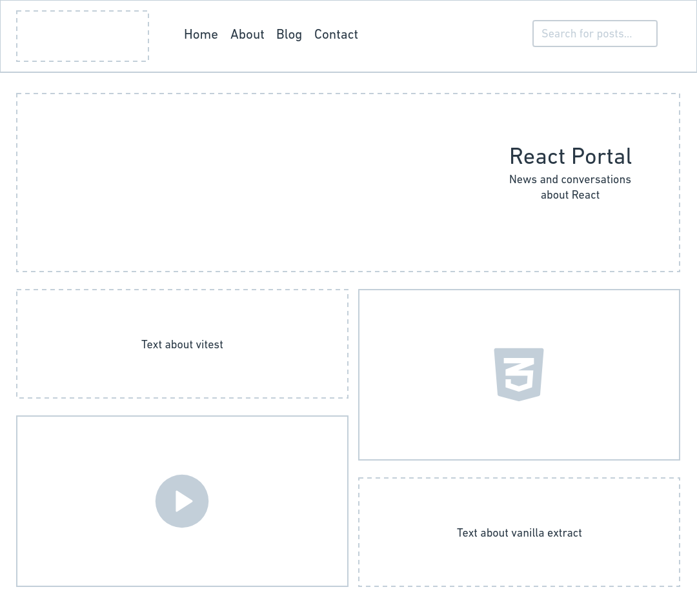
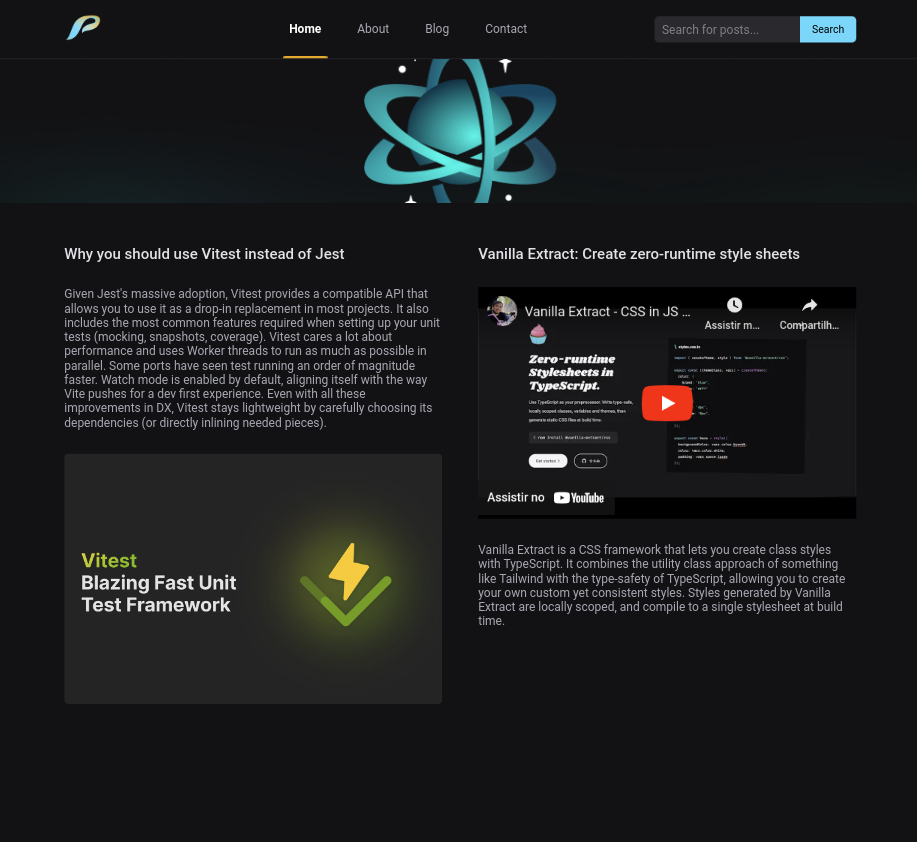

### About
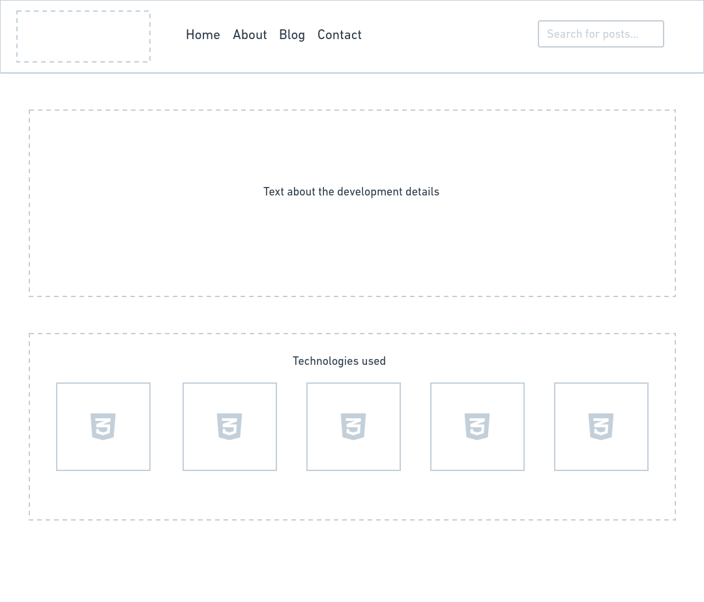
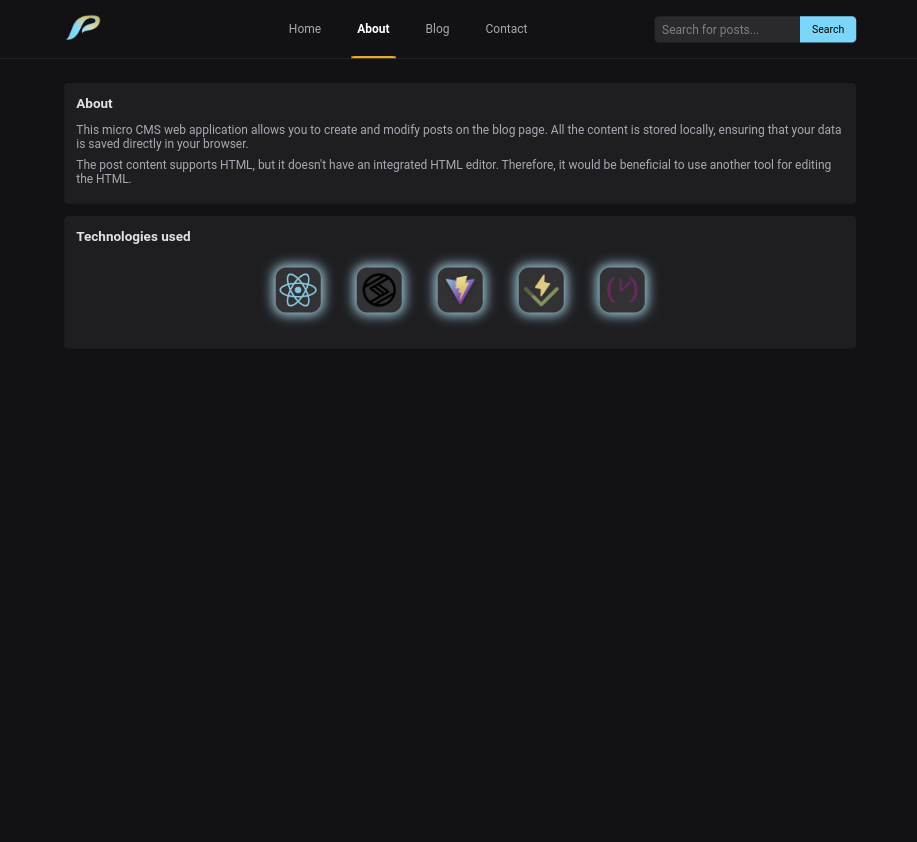

### Blog
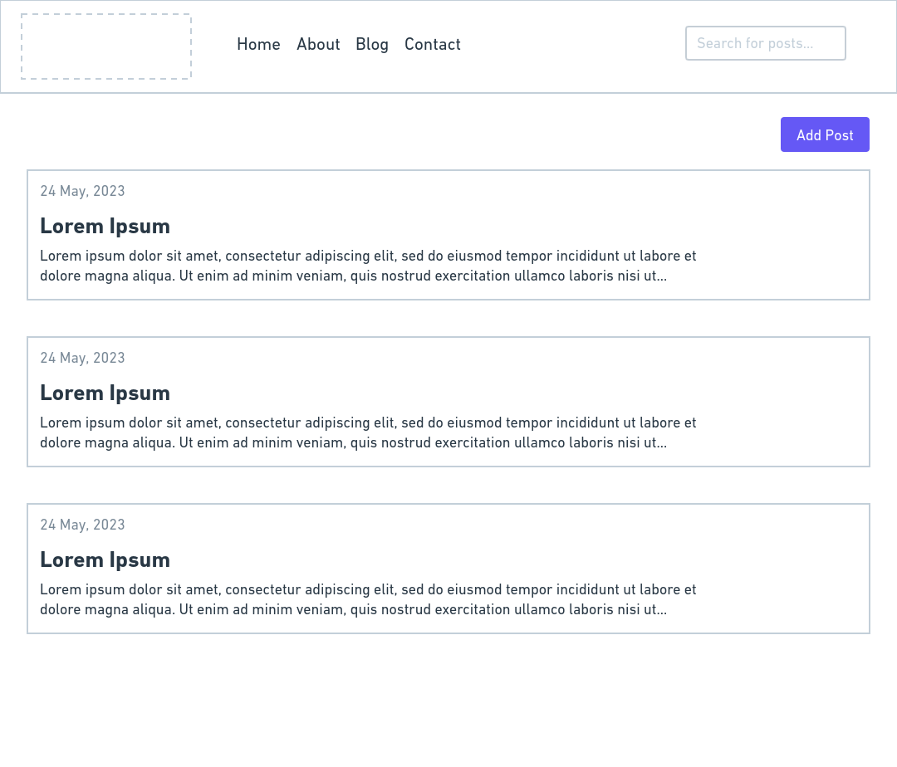
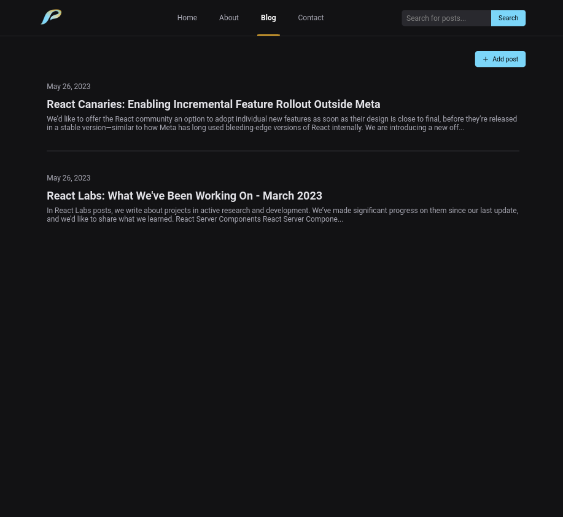

### Blog post
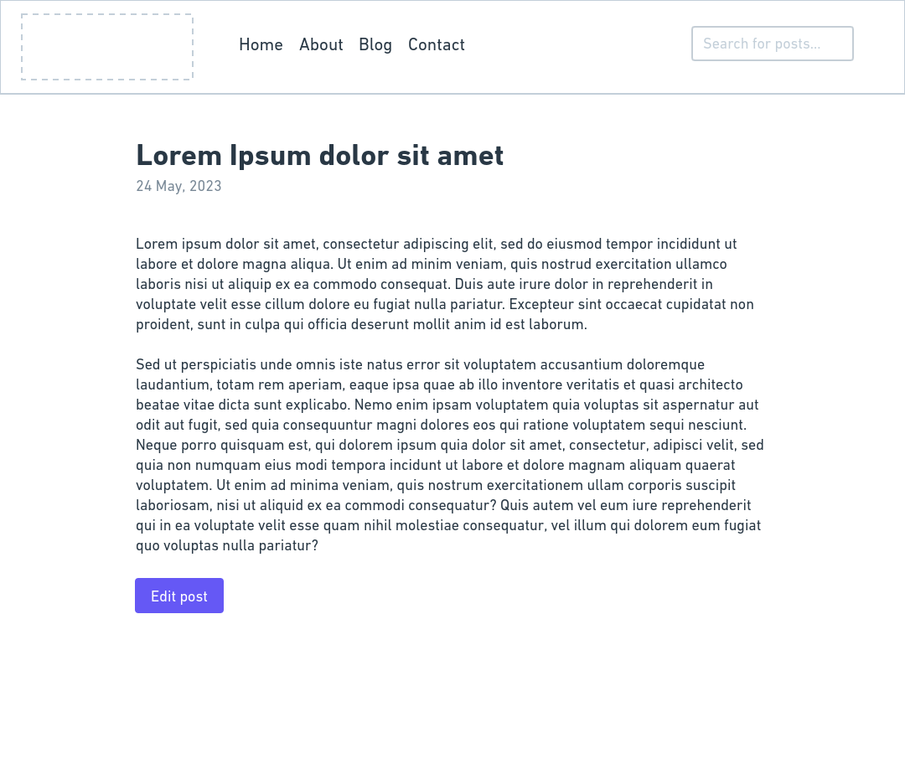
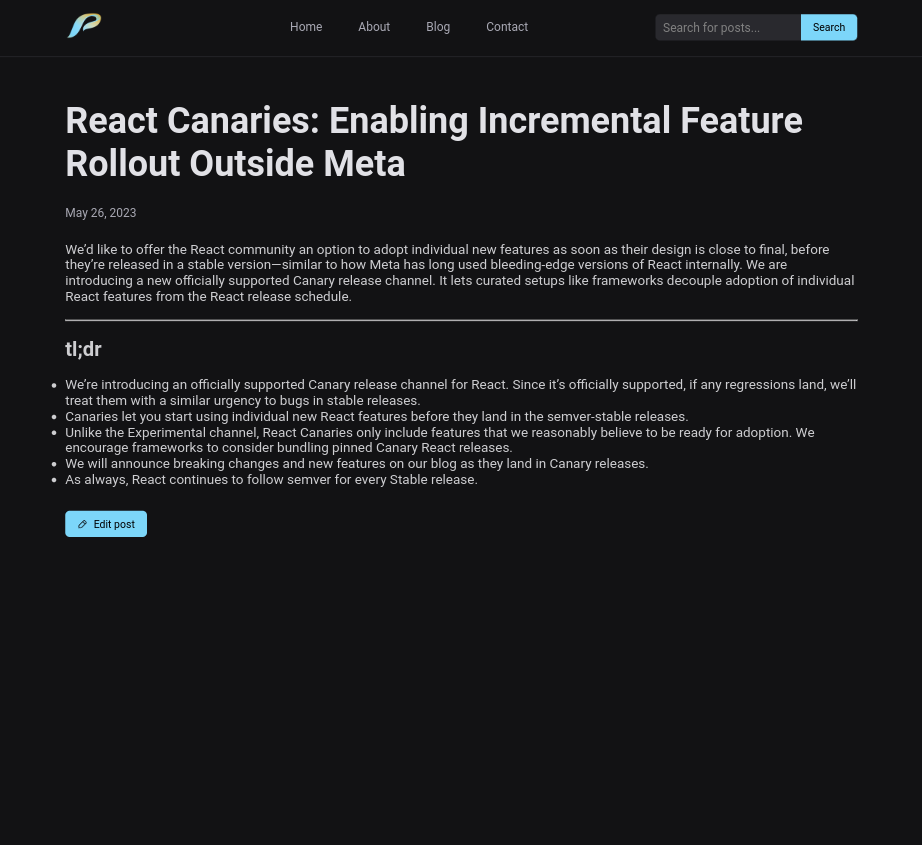

### Blog post create/edit
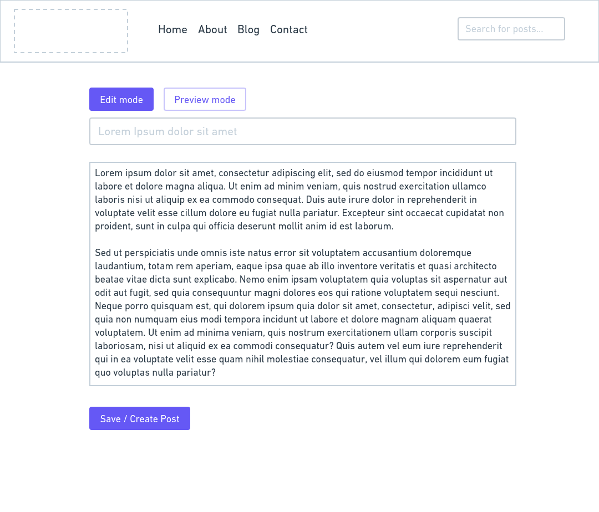
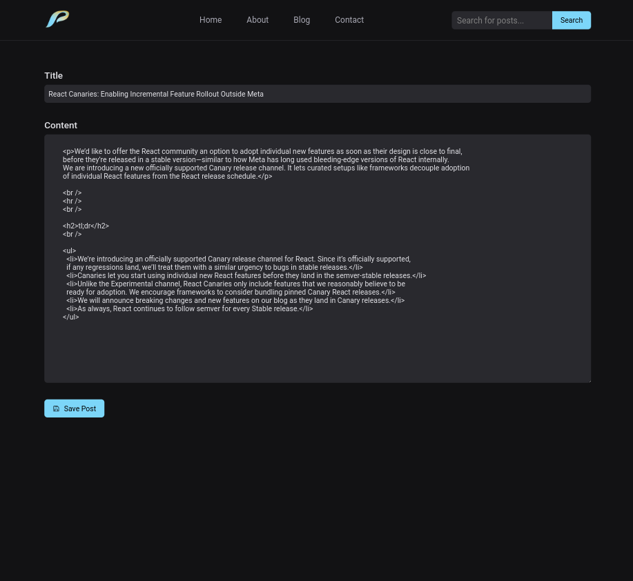

### Contact
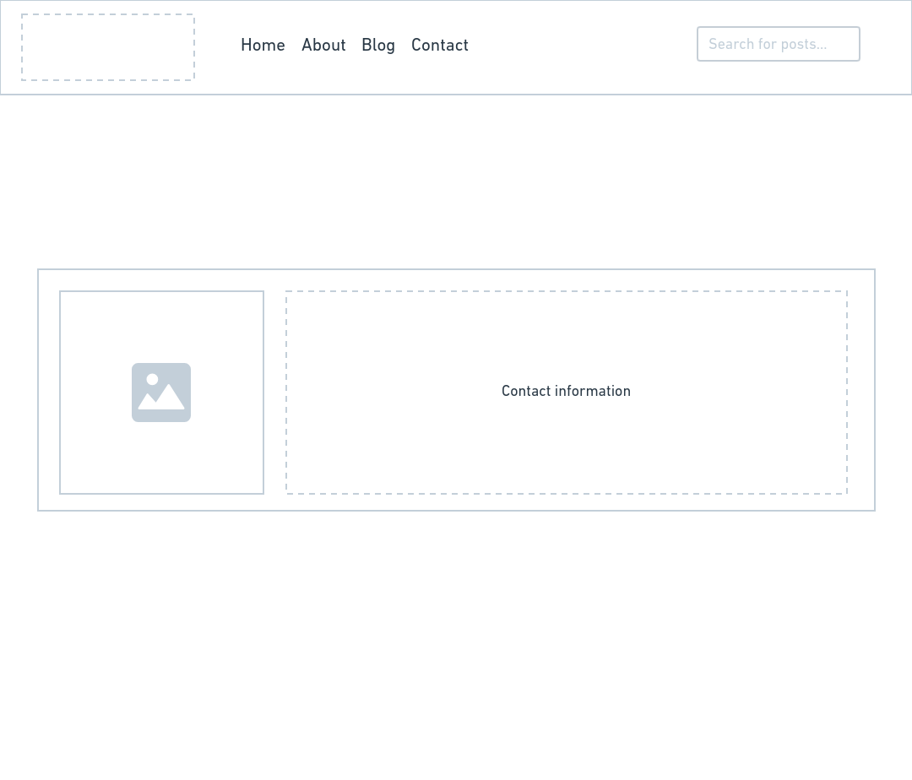
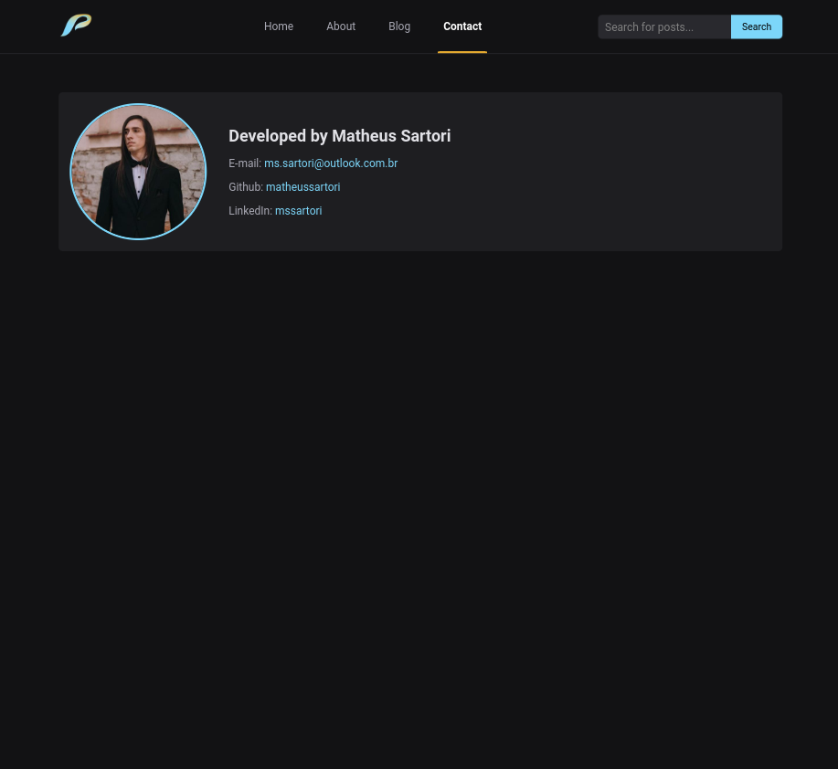
